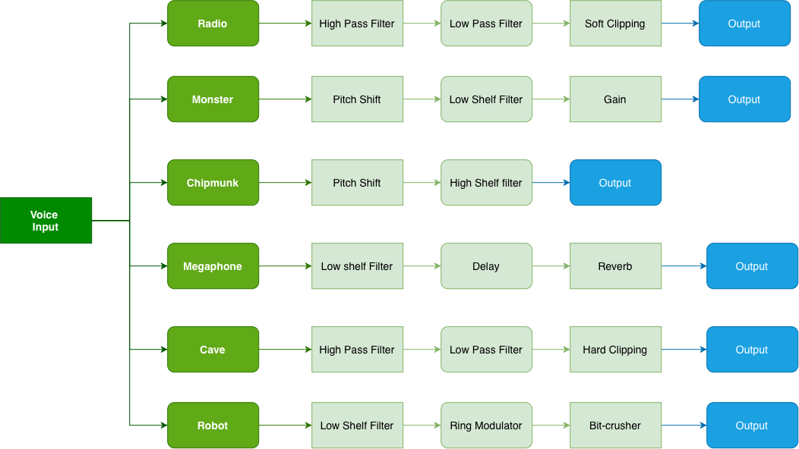

# HandySFX

A real-time voice character VST plugin built in C++/JUCE. Six DSP presets with a live oscilloscope visualiser (inspired in Karen, of SpongeBob Squarepants) and full parameter control.
## UI

## Voice Presets

| Preset | DSP Chain | Parameters |
|--------|-----------|------------|
| Radio | HPF + LPF + soft clip | HPF freq, LPF freq, Drive |
| Monster | Pitch shift ↓ + low shelf + drive | Pitch, Drive, Shelf |
| Chipmunk | Pitch shift ↑ + high shelf | Pitch, Shelf |
| Cave | Low shelf + delay + reverb | Room, Delay, Wet |
| Megaphone | Bandpass + hard clip + drive | HPF, LPF, Drive |
| Robot | Low shelf + ring mod + bitcrusher | Bits, Ring Freq, Shelf |

## Features

- Real-time oscilloscope visualiser
- Dynamic parameter panel per preset
- Custom LookAndFeel dark theme
- APVTS parameter state (DAW automation ready)
- Built with JUCE 8

## Signal Chain

## DSP Concepts

- IIR filters (HPF, LPF, shelving)
- Linear interpolation pitch shifting
- Delay lines
- Convolution reverb
- Ring modulation
- Bitcrushing

## Build

1. Open `HandySFX.jucer` in Projucer
2. Export to Xcode
3. Build

## Author

Nelly Garcia
nellyngz.com
